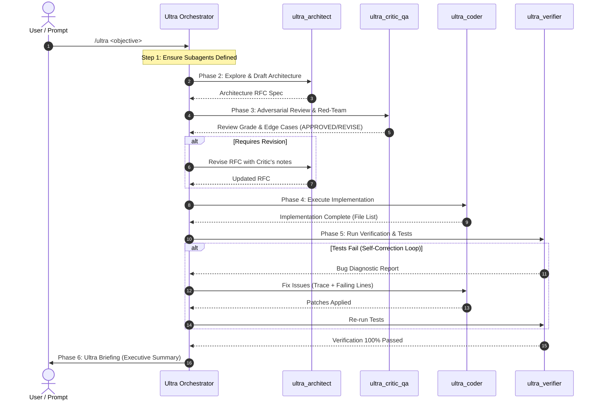

# GeminiUltra Workflow Protocols & Swarm Communication

This document outlines the operational phases, hand-off protocols, consensus thresholds, and message formats used within the GeminiUltra swarm.

---

## Swarm Lifecycle & Phase Sequence



---

## 1. Consensus Protocol (Phase 2 & 3)

The Architect drafts the RFC using the template below. The Critic evaluates the RFC against a 4-point rubric:
1. **Completeness**: Are all user requirements addressed?
2. **Security**: Are inputs sanitized, secrets protected, and command execution safe?
3. **Robustness**: Are network limits, null checks, and error boundaries defined?
4. **Maintainability**: Does the design avoid over-engineering?

### Consensus Decision Matrix:
* **APPROVED**: Both Architect and Critic agree. Proceed immediately to Phase 4 (Coder).
* **REVISE**: Critic raises critical issues. Architect amends the spec. Maximum 2 debate turns before Orchestrator arbitrates.
* **BLOCKED**: Fundamental conflict or unsafe user request. Swarm pauses to ask user clarification.

---

## 2. Standardized Message Formats

### Architecture RFC Template
```markdown
## [RFC] <Feature / Fix Name>
### 1. Problem & Context
<Summary of current state and target objective>

### 2. File Impact
- [MODIFY] path/to/file1.py (Functions to touch)
- [NEW] path/to/new_file.py (Purpose)
- [DELETE] path/to/deprecated.py

### 3. Implementation Steps
1. ...
2. ...

### 4. Edge Cases & Risk Analysis
- Edge case A: ...
- Potential performance impact: ...
```

### Critic Review Template
```markdown
## [CRITIC REVIEW] <RFC Name>
- **Status**: APPROVED | REVISE_REQUIRED | BLOCKED
- **Vulnerabilities / Edge Cases Found**:
  1. [Severity: High/Medium/Low] <Description & exploit/fail scenario>
- **Actionable Adjustments**:
  1. <Specific change required in design>
```

### Self-Correction Bug Report Template
```markdown
## [VERIFICATION FAILURE]
- **Command Run**: `npm test` / `pytest` / etc.
- **Exit Code**: Non-zero
- **Failure Summary**:
  ```
  <Captured stack trace or assertion error>
  ```
- **Failing Files & Line Numbers**: path/to/file.py:45
- **Expected vs Actual**:
  - Expected: ...
  - Actual: ...
- **Target Fix Recommendation**: <Concrete suggestion for ultra_coder>
```

---

## 3. Ultra Briefing Output Schema (Final Step)

When the entire swarm completes its mission, the Orchestrator presents an **Ultra Briefing** to the user containing:
1. **Executive Summary**: What was built or solved in 2-3 concise sentences.
2. **Swarm Collaboration Highlights**: Key improvements introduced by the Critic, architectural decisions made.
3. **Files Modified/Created**: Markdown links to each modified file.
4. **Verification Evidence**: Test commands executed and green status indicators.
5. **Next Steps**: Recommended follow-ups or deployment actions.
